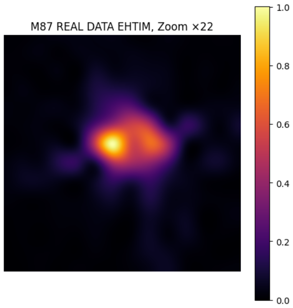

# M87 e Pianeti e Stelle


Mi sono appassionato ai buchi neri dopo aver letto due libri che mi hanno completamente catturato: "Buchi neri e salti temporali" di Kip Thorne, e "Luce dal nulla, L'immagine del buco nero e la nascita dell'astronomia del futuro" di Heino Falcke. Queste letture mi hanno aperto gli occhi su quanto la fisica dei buchi neri sia affascinante, ma anche profondamente legata alla nostra capacità di osservare l'universo in modi nuovi.

Kip Thorne è un fisico teorico statunitense, vincitore del Premio Nobel per la Fisica nel 2017 per il suo lavoro sulle onde gravitazionali con LIGO, e consulente scientifico per il film Interstellar. Con uno stile chiaro e immaginifico, ha saputo raccontare concetti estremamente complessi come i wormhole, la relatività generale e l'orizzonte degli eventi, rendendoli accessibili anche ai non addetti ai lavori.

Heino Falcke, astrofisico tedesco, è invece uno dei protagonisti reali della prima immagine di un buco nero mai ottenuta. È stato lui a proporre per primo la possibilità di osservare un'ombra del buco nero utilizzando una rete di radiotelescopi sulla Terra: una visione che si è concretizzata nel 2019 con l'immagine del buco nero al centro della galassia M87, ottenuta grazie alla collaborazione internazionale Event Horizon Telescope (EHT).

Proprio questa immagine ha ispirato il mio progetto: un tentativo di ricostruire l'immagine del buco nero M87 partendo dai dati osservativi, attraverso uno script didattico basato sul pacchetto eht-imaging (ehtim). Il notebook incluso, `ehtim_tutorial_m87.ipynb`, guida passo passo nell'elaborazione e nell'imaging dei dati interferometrici che simulano quelli raccolti dai radiotelescopi del progetto EHT.

Per eseguire il progetto è necessario installare alcune librerie scientifiche fondamentali come numpy, astropy, matplotlib e, ovviamente, ehtim. Considerando la complessità dell'ambiente e la presenza di librerie specifiche, è fortemente consigliato l'utilizzo di Docker: in questo modo si può lanciare un contenitore già configurato con tutte le dipendenze necessarie, garantendo un ambiente riproducibile e stabile.

Il mio obiettivo non è solo tecnico, ma anche divulgativo: mostrare come, con strumenti open source e dati pubblici, sia possibile riavvicinarsi a una delle più grandi imprese scientifiche degli ultimi decenni, e farlo in modo trasparente, accessibile e ripetibile.

---

## Indice

- [M87 - Ricostruzione Immagine Radioastronomica](#m87---ricostruzione-immagine-radioastronomica-di-m87-da-dati-uvfits)
- [Pianeti e Stelle - Panoramica del Progetto](#pianeti-e-stelle---panoramica-del-progetto)
- [Notebook del Progetto](#notebook-del-progetto)
- [Analisi Spettrale](#analisi-spettrale)
- [Risorse e Tutorial](#risorse-e-tutorial)
- [Dataset](#dataset)
- [Classificazione in base al Redshift](#classificazione-in-base-al-redshift)

---

## M87 - Ricostruzione Immagine Radioastronomica di M87 da dati UVFITS



### Descrizione generale

Questo notebook esegue la **ricostruzione di un'immagine astronomica reale** del buco nero di M87 a partire da dati interferometrici contenuti in un file **UVFITS**. I dati derivano da osservazioni VLBI (Very Long Baseline Interferometry), dove più radiotelescopi distribuiti sulla Terra osservano simultaneamente la stessa sorgente celeste. Vedi la cartella `M87_MY_WORK`. L'obiettivo è passare dal **dominio delle visibilità** (piano u-v, ossia trasformata di Fourier dei segnali ricevuti) alla **ricostruzione spaziale** (immagine dell'oggetto celeste).

### Workflow

1. **Caricamento dati UVFITS**
   - Utilizza `astropy.io.fits` per aprire il file `hops_lo_3601_M87+zbl-dtcal_selfcal.uvfits`.
   - Estrae le colonne `UU---SIN`, `VV---SIN` (coordinate spaziali normalizzate) e `DATA` (visibilità complesse: Re, Im, Peso).

2. **Pre-elaborazione delle visibilità**
   - Separazione delle componenti reali e immaginarie.
   - Media pesata sui canali, sfruttando i pesi (`WEIGHT`) per aumentare la robustezza.
   - Pulizia dei dati: rimozione di valori NaN o con peso nullo.

3. **Filtraggio delle baseline**
   - Conversione delle coordinate u,v in unità di lunghezza d'onda (`lambda`).
   - Eliminazione delle baseline corte (< 5 Mλ), che tendono ad aggiungere rumore e artefatti all'immagine.

4. **Interpolazione sul piano u-v**
   - Grigliatura delle visibilità su una mesh regolare con `scipy.interpolate.griddata`.
   - Scelta del metodo lineare con riempimento dei valori mancanti a 0.

5. **Trasformata di Fourier inversa (IFFT)**
   - Applicazione della trasformata inversa 2D per ottenere l'immagine nel dominio spaziale.
   - Shift delle componenti con `fftshift` per una corretta centratura.
   - Normalizzazione dell'intensità.

6. **Upscaling e visualizzazione**
   - Uso di interpolazione bicubica (`scipy.ndimage.zoom`) per aumentare la risoluzione visiva.
   - Visualizzazione con `matplotlib` e colormap **inferno**, adatta per imaging astronomico.

### Librerie utilizzate

- **[Astropy](https://www.astropy.org/)** → lettura file FITS/UVFITS.
- **[NumPy](https://numpy.org/)** → gestione array numerici e operazioni vettoriali.
- **[SciPy](https://scipy.org/)** → interpolazione (`griddata`), trasformate di Fourier, zoom bicubico.
- **[Matplotlib](https://matplotlib.org/)** → grafici e visualizzazione immagini.

### Metodologie e approcci

- **Interferometria radio**: le visibilità complesse rappresentano i campioni della trasformata di Fourier dell'immagine celeste.
- **Media pesata**: migliora il rapporto segnale/rumore integrando correttamente più canali.
- **Filtraggio baseline**: elimina contributi indesiderati da misure a bassa risoluzione angolare.
- **Interpolazione su griglia**: necessaria per applicare la IFFT, dato che i dati osservativi sono irregolarmente campionati.
- **FFT inversa**: permette di passare dal piano u-v (Fourier) al piano immagine.
- **Upscaling bicubico**: utile per la presentazione, senza introdurre nuova informazione scientifica.

### Output attesi

- Range delle baseline in unità di lunghezza d'onda.
- Visualizzazione del piano u-v interpolato.
- Ricostruzione dell'immagine di M87 (scala logaritmica consigliata per contrastare le forti dinamiche).
- Zoom ad alta risoluzione per evidenziare i dettagli.

### Possibili estensioni

- Applicazione di algoritmi avanzati di **deconvoluzione CLEAN**.
- Ricostruzione con **algoritmi regolarizzati** (es. Maximum Entropy, RML imaging).
- Analisi comparativa con altre frequenze / dataset.
- Automazione della pipeline per più UVFITS.

---

## Pianeti e Stelle - Panoramica del Progetto

Il progetto si articola in diverse aree di analisi dati astronomici:

### Classificazione Stellare

Utilizzo del catalogo **NASA Exoplanet Archive STELLARHOSTS** per classificare le stelle in tipi spettrali (O, B, A, F, G, K, M) in base alla temperatura efficace. Su ~45.000 stelle ospiti di esopianeti, la distribuzione osservata è:
- **Tipo G** (48%) – stelle simili al Sole
- **Tipo K** (27%) – nane arancioni
- **Tipo F** (21%) – stelle leggermente più calde del Sole
- **Tipo M** (3.5%) – nane rosse
- Tipi A, B, O e sconosciuti: percentuali minori

### Classificazione Esopianeti

Analisi del **Open Exoplanet Catalogue** con oltre 5.400 pianeti confermati. Per ogni stella ospite si analizza la temperatura, la massa, il raggio e altri parametri orbitali.

### Estrazione Features e Predizione con Rete Neurale

Utilizzo di un **CNN 1D** con TensorFlow/Keras su dati del **NASA Exoplanet Archive** (36.000+ righe) per la classificazione di esopianeti dalle loro caratteristiche fisiche e orbitali.

### Analisi Spettrale di K2-18b

Analisi dei dati spettroscopici del pianeta **K2-18b** dal dataset JWST NIRSpec (Madhusudhan et al. 2023) per identificare molecole carboniose nell'atmosfera.

### Database SIMBAD e Query Astronomiche

Interrogazione del database **SIMBAD** tramite `astroquery` per ottenere coordinate e metadati di oggetti celesti (es. HD 209458, stella ospite dell'esopianeta Osiris).

### Firme Spettrali Molecolari

Simulazione e riconoscimento di **firme spettrali molecolari** (H2O, CH4, CO2, CO, NH3, O3, H2, N2O, SO2) utilizzando:
- **Dati sintetici**: bande di assorbimento note in letteratura nel range 1.0–5.5 μm
- **Dati reali NIST**: spettri IR reali scaricati dal NIST Chemistry WebBook (formato JCAMP-DX)
- **Identificazione quantitativa**: correlazione di Pearson e Non-Negative Least Squares (NNLS)

### Analisi della Radiazione Cosmica di Fondo (CMB)

Processamento della mappa CMB **Planck SMICA** (NSIDE=2048, ~50M pixel) con `healpy`:
- Mappa Mollweide della temperatura
- Analisi dello spettro di potenza angolare con picchi acustici a ell ~ 220, 540, 810
- Anomalie CMB: Cold Spot, asimmetria emisferica, allineamento bassi multipoli (quadrupolo/ottupolo)

---

## Notebook del Progetto

### M87

| Notebook | Descrizione |
|----------|-------------|
| `M87/ehtim_tutorial_m87.ipynb` | Tutorial ufficiale eht-imaging per imaging polarimetrico di M87 |
| `M87/ehtim_tutorial_m87-MY_WORK.ipynb` | Versione modificata del tutorial ehtim |
| `M87/M87_IMAGE_1.ipynb` | Tentativo di clonazione e imaging con eht-imaging |
| `M87/M87_IMAGE_2.ipynb` | Ricostruzione via SVD da coordinate UV |
| `M87_MY_WORK/0_REAL_IMAGE_M87.ipynb` | **Pipeline principale**: caricamento UVFITS → interpolazione → IFFT → ricostruzione immagine |

### Scripts - Astropy

| Notebook | Argomento |
|----------|-----------|
| `000_Astropy.ipynb` | Introduzione ad Astropy: SkyCoord e caricamento immagini con OpenCV |
| `001_Astropy_fits.ipynb` | Lettura e scrittura di file FITS |
| `002_Astropy_wavelength.ipynb` | Analisi delle lunghezze d'onda |
| `003_Astropy_dati_spettrali.ipynb` | Analisi dati spettrali |
| `004_Astropy_Dati_Spettrali_Elementi.ipynb` | Spettri elementali |

### Scripts - Classificazione

| Notebook | Argomento |
|----------|-----------|
| `005_Classificazione_Esopianeti.ipynb` | Classificazione esopianeti da Open Exoplanet Catalogue |
| `006.1_Classificazione_Stelle.ipynb` | Classificazione stellare (tipi O–M) da NASA STELLARHOSTS |
| `010_Exoplanet_Features_Extration_&_Predizione_2.0.ipynb` | CNN 1D per classificazione esopianeti |

### Scripts - Spettroscopia e Database

| Notebook | Argomento |
|----------|-----------|
| `011_Simbad_Database.ipynb` | Query SIMBAD per HD 209458 |
| `012_PIANETA_K2-18b.ipynb` | Analisi spettrale K2-18b da JWST NIRSpec |
| `013_Firme_Spettrali_Molecole.ipynb` | Firme spettrali molecolari (dati sintetici + HITRAN) |
| `014_Analisi_Dati_Reali_NIST.ipynb` | Spettri IR reali NIST + identificazione molecolare |
| `015_K2-18b_Firme_Spettrali.ipynb` | K2-18b: firme spettrali molecolari |

### Scripts - Cosmologia

| Notebook | Argomento |
|----------|-----------|
| `016_CMB_Anomalie.ipynb` | Analisi CMB Planck SMICA: mappa, spettro di potenza, anomalie |

### Scripts - Redshift

| Notebook | Argomento |
|----------|-----------|
| `007_Redshift_Erorr.ipynb` | Analisi errori redshift |
| `008.Redshift_SDSS.ipynb` | Analisi dati redshift SDSS |
| `009.Database_Star_Quasar_SDSS.ipynb` | Classificazione stelle/quasar SDSS |

---

## Analisi Spettrale

### Analisi Spettrale della Luce Riflessa

I pianeti riflettono la luce in determinate lunghezze d'onda che possono essere analizzate per identificare la composizione chimica. Ogni elemento chimico ha un'impronta digitale nel suo spettro di assorbimento, visibile in immagini spettrografiche.

Per simulare questo con un'immagine normale, puoi analizzare i canali di colore (RGB o, preferibilmente, HSL o YUV) per identificare caratteristiche salienti della riflessione. L'elaborazione delle immagini può essere fatta con **OpenCV** per estrarre feature legate a luminosità, distribuzione dei colori e texture, utili per algoritmi di classificazione.

### Spettroscopia Simulata

Per aggiungere un livello realistico, si possono usare tecniche di spettroscopia simulata per mappare l'intensità della luce a varie lunghezze d'onda e associare queste informazioni con firme spettrali di materiali noti (acqua, metano, ecc.). L'uso di strumenti come **pandas** e **scikit-learn** per modelli di regressione può essere utile per analizzare questi dati.

**Dataset consigliato**: [Astronomical Data in Python](https://allendowney.github.io/AstronomicalData/README.html) – guida pratica che include:
- Scrittura di query per database astronomici
- Utilizzo di Astropy Tables e Pandas DataFrames
- Coordinate celesti e unità fisiche
- Archiviazione dati in vari formati
- Join tra tabelle
- Visualizzazione dati per pubblicazioni

---

## Dati Spettrali

Risorse per spettri atomici e molecolari:

| Risorsa | Descrizione |
|---------|-------------|
| [Atomic Spectra](http://www.andrewtalbot.info/atomspector/) | Spettri atomici interattivi con dati visivi e lunghezze d'onda per ogni elemento |
| [WebElements](https://periodictable.com/Properties/A/Spectrum.html) | Galleria di spettri atomici con immagini e dati spettroscopici |
| [NIST Atomic Spectra Database](https://physics.nist.gov/PhysRefData/ASD/lines_form.html) | Database spettroscopico con livelli energetici e transizioni elettroniche |
| [HITRANonline](https://hitran.org/) | Database di linee spettrali molecolari per atmosfere planetarie |

---

## Risorse e Tutorial

### Tutorial file FITS

- [Astropy FITS Tutorial](https://learn.astropy.org/tutorials/FITS-images.html): aprire, visualizzare, stackare e salvare immagini FITS
- [Hubble Legacy Archive](https://hla.stsci.edu/): dati osservativi Hubble
- [ESA Archive Explorer](https://hst.esac.esa.int/hcv-explorer/): archivio ESA per dati spaziali
- [NASA SkyView](https://skyview.gsfc.nasa.gov/): servizio semplice per download file FITS (es. M87)

### Riferimenti

- **Tesi di Laurea**: Classificazione spettrale delle stelle – [Prandi Riccardo, UniBo](https://amslaurea.unibo.it/19482/1/Classificazione_spettrale_delle_stelle_Prandi_Riccardo.pdf)

---

## Dataset

| Dataset | URL | Descrizione |
|---------|-----|-------------|
| **Open Exoplanet Catalogue** | [openexoplanetcatalogue.com](https://openexoplanetcatalogue.com/) | Catalogo decentralizzato e aperto di tutti gli esopianeti scoperti |
| **NASA Exoplanet Archive** | [exoplanetarchive.ipac.caltech.edu](https://exoplanetarchive.ipac.caltech.edu/) | Database NASA con filtri per stelle ospiti (STELLARHOSTS) |
| **NED** | [ned.ipac.caltech.edu](https://ned.ipac.caltech.edu/) | Database multi-frequenza di oggetti extragalattici (galassie, stelle, QSO) con redshift |
| **SDSS SkyServer** | [skyserver.sdss.org/dr18](https://skyserver.sdss.org/dr18) | Sloan Digital Sky Survey – dati fotometrici e spettroscopici |
| **DESI specprod-db** | [github.com/desihub/specprod-db](https://github.com/desihub/specprod-db) | Database delle produzioni spettroscopiche DESI |
| **SIMBAD** | [simbad.u-strasbg.fr](https://simbad.u-strasbg.fr/simbad/) | Database di riferimento per oggetti astronomici (stelle, galassie, pianeti) |
| **Gaia ESA** | [gea.esac.esa.int](https://gea.esac.esa.int/archive/) | Missione ESA per posizioni e caratteristiche stellari |
| **TESS NASA** | [exoplanetarchive.ipac.caltech.edu](https://exoplanetarchive.ipac.caltech.edu/) | Missione NASA per scoperta esopianeti con metodo del transito |

---

## Classificazione in base al Redshift

Il **redshift** è lo spostamento verso il rosso della luce emessa da oggetti astronomici, causato dall'espansione dell'universo. La formula fondamentale è:

```
z = (λ_osservata - λ_emessa) / λ_emessa
```

dove `z` è il redshift, `λ_osservata` la lunghezza d'onda misurata e `λ_emessa` quella a riposo. Valori crescenti di `z` indicano distanze e velocità di recessione maggiori (legge di Hubble-Lemaître).

### Classificazione oggetti per redshift

- **Stelle**: `z` ≈ 0 (legato al moto proprio, effetti relativistici trascurabili)
- **Galassie**: `z` da ~0.001 a ~10+
- **Quasar (QSO)**: `z` da ~0.1 a ~7+

1. TTV Mining: Scopri Pianeti Invisibili
I transiti nei dati TESS/Kepler non sono perfettamente regolari. Un secondo pianeta non transitante altera i tempi con la sua gravità. Tu:
- Scarichi curve di luce TESS di sistemi con 1 pianeta noto
- Misuri i tempi di ogni singolo transito con high-precision fitting
- Analizzi le TTV (Transit Timing Variations) — oscillazioni nel tempo di arrivo
- Se trovi un pattern periodico → hai scoperto un pianeta che nessuno ha mai visto direttamente
- Con MCMC stimi massa e orbita del pianeta nascosto
Nessun progetto amatoriale fa TTV mining. È roba da paper professionali.
2. Exomoon Search: Caccia alle Lune Extrasolari
Una luna extrasolare causa TTV + TDV (Transit Duration Variation) simultaneamente. Filtro matched su curve di luce Kepler/TESS per trovare coppie TTV/TDV correlate. Se trovi entrambi con lo stesso periodo → candidata esoluna.
Ad oggi ci sono solo ~5 candidati esolune in letteratura. Potresti trovarne una.
3. Exoplanet Demographics: Correzione dei Bias Osservativi
I cataloghi che hai sono distorti: troviamo più Giove caldi perché sono facili da vedere. Tu:
- Simula milioni di sistemi planetari con distribuzioni realistiche (power-law in massa/periodo)
- Calcola per ognuno la probabilità di essere scoperto (geometria transito, SNR, durata)
- Confronta col catalogo reale → inferisci le vere distribuzioni non distorte
- Output: "Nella galassia, il 40% delle stelle ha Super-Terre, ma ne vediamo solo il 2%"
È ciò che fanno gli astronomi professionali (Fulton+, Petigura+, etc.). Nessun amatore lo fa.
4. Stellar Activity vs Transito: Autoencoder per Curve di Luce
Macchie stellari e rotazione imitan0 i transiti planetari e contaminano i dati. Addestra un autoencoder convoluzionale su curve di luce TESS:
- Impara a ricostruire curve di luce senza transiti (solo attività)
- Sottrai dall'originale → rimane solo il segnale planetario
- Migliora la rilevazione di pianeti piccoli (Sub-Nettuno, Super-Terra)
Approccio originale: invece di modellare fisicamente le macchie, impari dalla statistica dei dati.
5. Galactic Archaeology con Gaia: Mappa 3D della Via Lattea
Scarichi dati Gaia DR3 (posizioni, parallassi, moti propri, colori) per centinaia di migliaia di stelle:
- Filtri per metallicità, età cinematiche, velocità
- Ricostruisci le correnti stellari (resti di galassie nane mangiate dalla Via Lattea)
- Visualizzazione 3D interattiva con Plotly/Three.js: ogni flusso stellare è un fiume di stelle con la sua storia
- Output: "Queste 5000 stelle vengono da una galassia nana che si è fusa 8 miliardi di anni fa"

